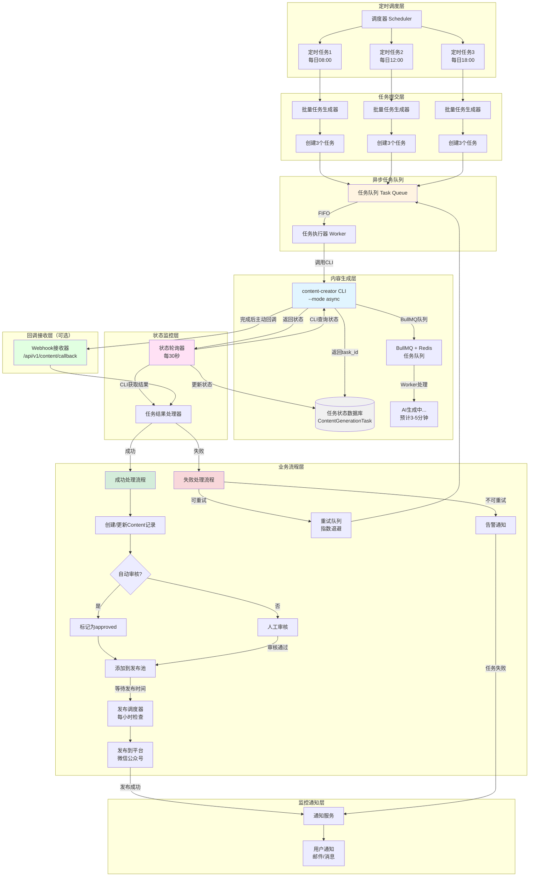
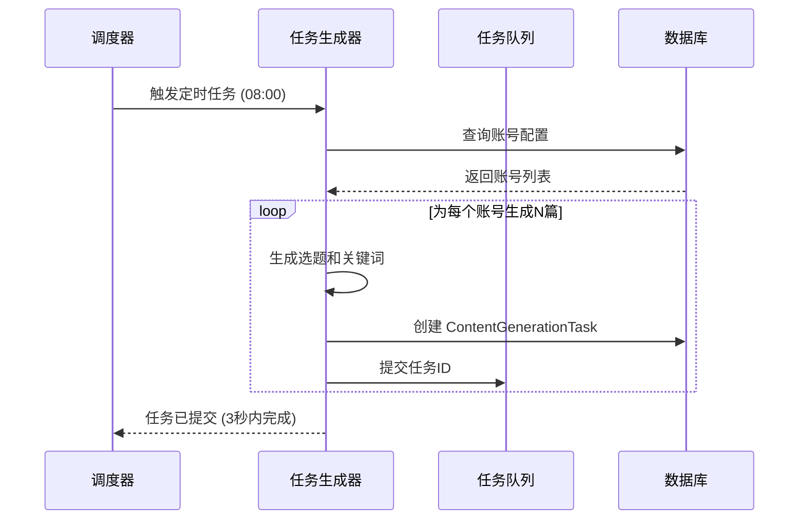
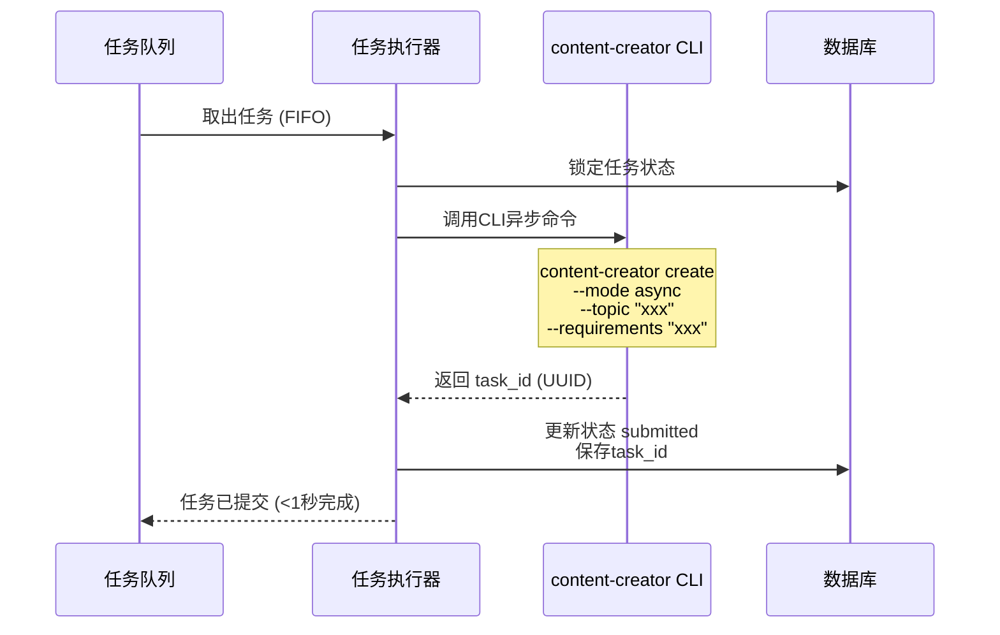
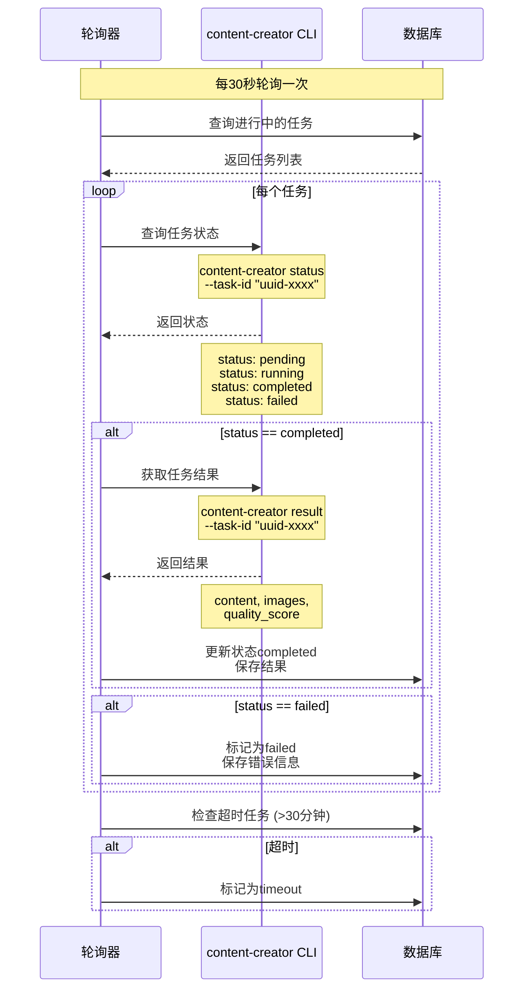
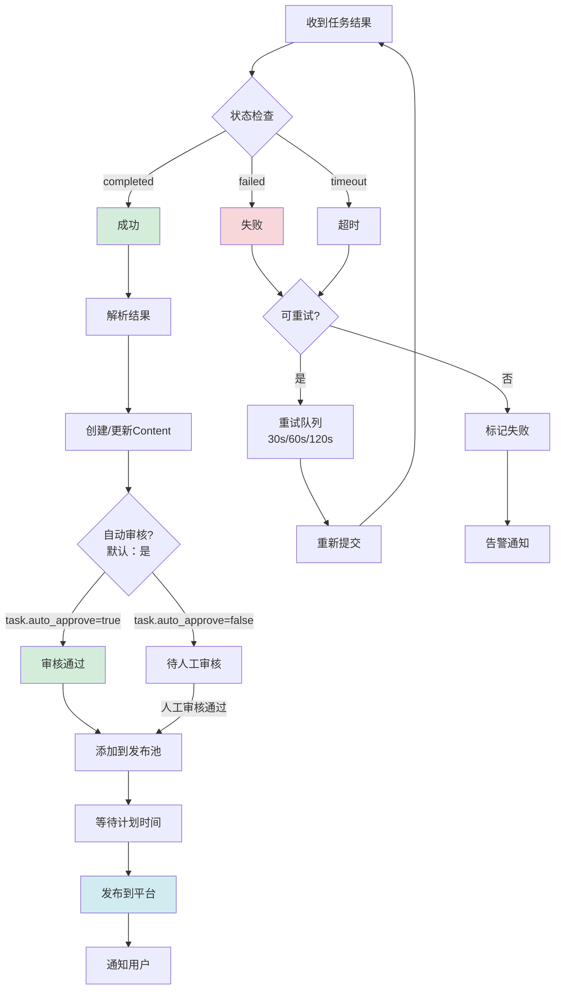
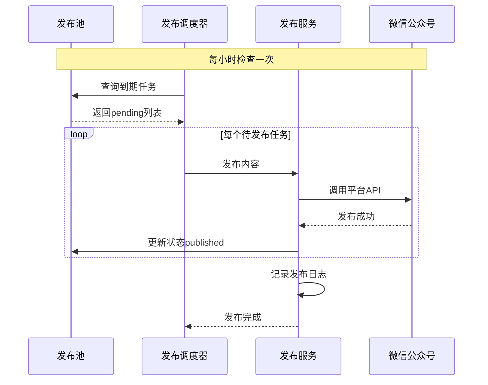

# ContentHub 异步内容生成系统设计方案

## 设计目标

实现无人值守的内容生产流水线：**定时触发 → 异步生成 → 自动审核 → 发布池 → 自动发布**

---

## 系统架构流程图



---

## 详细流程说明

### 阶段 1：定时任务触发



**关键点**：
- 定时任务不阻塞，只负责提交任务
- 批量创建任务记录到数据库
- 任务状态：`pending`

---

### 阶段 2：异步任务提交



**content-creator CLI 调用示例**：

```bash
# 提交异步任务
content-creator create \
  --type content-creator \
  --mode async \
  --topic "2025年汽车智能化技术发展" \
  --requirements "写一篇1500字的专业分析文章" \
  --target-audience "汽车行业从业者" \
  --tone "专业" \
  --image-size "1920x1080"

# 返回输出：
# ✅ 任务已提交
# 任务ID: uuid-xxxx-xxxx
# 状态: pending
# 模式: async
```

**关键点**：
- Worker 从队列取出任务
- 通过 subprocess 调用 content-creator CLI
- 使用 `--mode async` 参数
- 立即返回 UUID 格式的 task_id
- 任务状态：`pending` → `submitted`

---

### 阶段 3：状态监控（轮询 + Webhook 双重保障）



**content-creator CLI 查询命令**：

```bash
# 查询任务状态
content-creator status --task-id "uuid-xxxx"

# 返回输出：
# 任务ID: uuid-xxxx
# 状态: running
# 进度: 75%
# 开始时间: 2026-02-08 08:00:00
# 更新时间: 2026-02-08 08:03:30

# 获取任务结果（完成后）
content-creator result --task-id "uuid-xxxx"

# 返回输出（JSON格式）：
# {
#   "taskId": "uuid-xxxx",
#   "status": "completed",
#   "content": "# 文章标题\n\n文章内容...",
#   "images": ["data/images/image1.jpg"],
#   "qualityScore": 8.5,
#   "metrics": {
#     "wordCount": 1500,
#     "duration": "3分25秒"
#   }
# }
```

**关键点**：
- **轮询间隔**：每30秒检查一次所有进行中的任务（兜底机制）
- **Webhook 回调**（已实施）：content-creator 完成时主动回调 ContentHub（实时，<2秒延迟）
- **状态查询**：使用 `content-creator status` 命令
- **结果获取**：状态为 completed 时使用 `content-creator result` 命令
- **超时检测**：超过30分钟自动标记为超时
- **BullMQ 队列**：content-creator 内部使用 BullMQ + Redis 管理任务

**Webhook 回调说明**（已实施，实施日期：2026-02-08）：

ContentHub 已实现完整的 Webhook 回调接收功能，与轮询机制互为补充。

**实施状态**：
- 实施日期：2026-02-08
- 实施状态：已完成，已通过测试
- 代码文件：
  - `/src/backend/app/services/webhook_handler.py` - Webhook 处理服务
  - `/src/backend/app/utils/webhook_signature.py` - 签名验证工具
  - `/src/backend/tests/test_webhook_signature.py` - 签名验证测试
  - `/src/backend/tests/test_webhook_callback_integration.py` - 集成测试
- 功能特性：
  - 支持任务完成、失败、进度更新事件
  - HMAC-SHA256 签名验证（可选）
  - 自动幂等性处理（避免重复处理）
  - 完整的错误处理和日志记录

如果 content-creator 实现了 Webhook 回调功能，可以在提交任务时传递回调 URL：

```bash
content-creator create \
  --mode async \
  --topic "文章主题" \
  --callback-url "http://content-hub:18010/api/v1/content/callback"
```

当任务完成时，content-creator 会主动调用 ContentHub 的回调端点：
- **实时性**：任务完成后立即通知，延迟 < 2 秒
- **降低负载**：减少轮询请求，节省资源
- **可靠性**：与轮询机制互为补充，确保任务状态最终一致
- **安全性**：支持 HMAC-SHA256 签名验证

> **配置说明**：详见 [Webhook 配置指南](../guides/webhook-configuration.md)

> **注意**：Webhook 是可选功能。即使不启用 Webhook，ContentHub 的轮询机制也能保证任务正常完成。

---

### 阶段 4：结果处理和业务流转



**关键点**：
- 成功：自动创建 Content → 自动审核 → 发布池 → 发布
- 失败：检查错误类型 → 重试或告警
- 超时：标记为超时 → 可选择重试

---

### 阶段 5：发布池自动发布



**关键点**：
- 调度器每小时检查发布池
- 批量发布所有到期内容
- 失败自动重试（最多3次）

---

## 数据模型设计

### ContentGenerationTask（生成任务表）

```sql
CREATE TABLE content_generation_tasks (
    id INTEGER PRIMARY KEY,
    task_id VARCHAR(100) UNIQUE,        -- content-creator任务ID
    content_id INTEGER,                  -- 关联的Content ID
    account_id INTEGER NOT NULL,         -- 账号ID
    topic VARCHAR(500),                  -- 选题
    keywords VARCHAR(500),               -- 关键词
    category VARCHAR(100),               -- 内容板块
    requirements TEXT,                   -- 创作要求
    tone VARCHAR(50),                    -- 语气风格

    -- 任务状态
    status VARCHAR(50) DEFAULT 'pending', -- pending/submitted/running/completed/failed/timeout
    priority INTEGER DEFAULT 5,          -- 优先级1-10
    retry_count INTEGER DEFAULT 0,       -- 重试次数
    max_retries INTEGER DEFAULT 3,       -- 最大重试次数

    -- 时间戳
    submitted_at DATETIME,
    started_at DATETIME,
    completed_at DATETIME,
    timeout_at DATETIME,                 -- 超时时间

    -- 结果
    result JSON,                         -- 生成结果
    error_message TEXT,

    -- 回调
    callback_url VARCHAR(500),
    callback_status VARCHAR(50),         -- pending/sent/failed

    created_at DATETIME DEFAULT CURRENT_TIMESTAMP,
    updated_at DATETIME DEFAULT CURRENT_TIMESTAMP
);

CREATE INDEX idx_task_status ON content_generation_tasks(status);
CREATE INDEX idx_task_account ON content_generation_tasks(account_id);
CREATE INDEX idx_task_submitted ON content_generation_tasks(submitted_at);
```

### Content（内容表）修改

```sql
-- 新增字段
ALTER TABLE contents ADD COLUMN generation_task_id VARCHAR(100);
ALTER TABLE contents ADD COLUMN auto_publish BOOLEAN DEFAULT FALSE;
ALTER TABLE contents ADD COLUMN scheduled_publish_at DATETIME;
```

---

## 配置参数

### 异步任务配置

```python
# config.py
ASYNC_CONTENT_GENERATION = {
    # 并发控制
    'MAX_CONCURRENT_TASKS': 5,          # 最大并发任务数
    'QUEUE_SIZE': 100,                   # 队列大小

    # 超时配置
    'TASK_TIMEOUT': 1800,                # 单个任务超时（秒，30分钟）
    'MAX_EXECUTION_TIME': 3600,          # 最大执行时间（秒）

    # 重试配置
    'MAX_RETRIES': 3,                    # 最大重试次数
    'RETRY_DELAYS': [30, 60, 120],       # 重试延迟（秒）

    # 轮询配置
    'POLL_INTERVAL': 30,                 # 轮询间隔（秒）
    'POLL_ENABLED': True,                # 是否启用轮询

    # 队列配置（降级机制）
    'QUEUE_TYPE': 'auto',                # auto | redis | memory
    'REDIS_URL': 'redis://localhost:6379/0',
    'REDIS_ENABLED': True,               # Redis是否可用（自动检测）

    # content-creator 配置
    'CREATOR_CLI_PATH': '/path/to/content-creator',
    'CREATOR_MODE': 'async',             # sync | async

    # 自动流程
    'AUTO_APPROVE': True,                # 默认自动审核（可被任务参数覆盖）
    'AUTO_ADD_TO_POOL': True,            # 自动添加到发布池
    'AUTO_PUBLISH': False,               # 是否自动发布（需谨慎）
}
```

**队列降级机制**：

```python
class TaskQueueFactory:
    """任务队列工厂，支持 Redis 和内存队列降级"""

    @staticmethod
    def create_queue():
        # 优先使用 Redis 队列
        if config.REDIS_ENABLED:
            try:
                return RedisTaskQueue(config.REDIS_URL)
            except Exception as e:
                logger.warning(f"Redis 连接失败，降级到内存队列: {e}")

        # 降级到内存队列
        return MemoryTaskQueue(maxsize=100)
```

**自动审核配置**：

- **全局默认**：`AUTO_APPROVE = True`（默认开启）
- **任务级别**：创建任务时可通过 `auto_approve` 参数覆盖
- **影响范围**：
  - `auto_approve=true`：生成完成 → 自动审核通过 → 发布池
  - `auto_approve=false`：生成完成 → 待审核 → 人工审核 → 发布池

---

## 工作流程示例

### 场景：每日早8点生成3篇文章

```mermaid
flowchart LR
    T[08:00 定时触发] --> A[查询账号配置]
    A --> B[创建3个生成任务]
    B --> C[提交到任务队列]
    C --> D[立即返回: 3个任务已提交]

    D --> E[Worker执行器]
    E --> F1[任务1: 调用API]
    E --> F2[任务2: 调用API]
    E --> F3[任务3: 调用API]

    F1 --> G1[task_001: AI生成中]
    F2 --> G2[task_002: AI生成中]
    F3 --> G3[task_003: AI生成中]

    G1 --> H1[3分钟后完成]
    G2 --> H2[4分钟后完成]
    G3 --> H3[3.5分钟后完成]

    H1 --> I[Webhook回调]
    H2 --> I
    H3 --> I

    I --> J[创建Content记录]
    J --> K[自动审核通过]
    K --> L[添加到发布池]
    L --> M[等待9:00发布]

    M --> N[09:00 调度器触发]
    N --> O[批量发布3篇]

    O --> P[发布成功通知]

    style T fill:#fff3cd
    style G1 fill:#e1f5ff
    style G2 fill:#e1f5ff
    style G3 fill:#e1f5ff
    style I fill:#d4edda
    style O fill:#d1ecf1
```



**时间线**：
- `08:00:00` - 定时任务触发，提交3个任务（耗时3秒）
- `08:00:03` - 所有任务已提交，定时任务结束
- `08:00:05` - Worker开始执行任务1
- `08:00:06` - Worker开始执行任务2
- `08:00:07` - Worker开始执行任务3
- `08:03:30` - 任务1完成，Webhook回调
- `08:04:20` - 任务3完成，Webhook回调
- `08:04:40` - 任务2完成，Webhook回调
- `08:04:41` - 所有内容已推入发布池
- `09:00:00` - 调度器触发发布
- `09:00:30` - 3篇文章全部发布成功

**总计**：
- 定时任务阻塞时间：**3秒**
- 生成总耗时：**约4分钟**（并行执行）
- 用户体验：几乎立即返回

---

## CLI 命令设计

### 异步任务相关

```bash
# 提交异步任务（立即返回）
content generate --async -a 49 -t "选题" --keywords "关键词"
# 输出：✅ 任务已提交 (task_id: task_xxx)

# 查询任务状态
content task-status task_xxx
# 输出：
# 任务ID: task_xxx
# 状态: running (75%)
# 开始时间: 2026-02-08 08:00:05
# 预计完成: 2026-02-08 08:04:05

# 列出所有任务
content task-list --status running
# 输出：进行中的任务列表

# 取消任务
content task-cancel task_xxx

# 重试失败任务
content task-retry task_xxx
```

### 定时任务相关

```bash
# 创建异步生成任务
scheduler create \
  --name "每日早间内容" \
  --type async_content_generation \
  --cron "0 8 * * *" \
  --account-id 49 \
  --params '{"count": 3, "auto_approve": true}'

# 查看任务执行历史
scheduler history 17
```

---

## 监控指标

### 任务统计
- 当前运行中任务数
- 今日完成任务数
- 任务成功率
- 平均执行时长
- 队列积压情况

### 性能指标
- Worker 利用率
- API 响应时间
- Webhook 成功率
- 重试次数统计

### 告警规则
- 任务超时率 > 10%
- 失败率 > 20%
- 队列积压 > 50
- Worker 异常

---

## Webhook 接收端点实现（ContentHub）

当 content-creator 启用 Webhook 回调功能时，ContentHub 需要提供接收端点来处理回调。

### 回调端点设计

**端点路径**: `/api/v1/content/callback/{task_id}`
**请求方法**: POST
**认证方式**: API Key 或 HMAC 签名（可选）

**请求格式**:

```json
{
  "event": "completed",
  "taskId": "uuid-xxxx-xxxx",
  "workflowType": "content-creator",
  "status": "completed",
  "timestamp": "2026-02-08T12:00:00Z",
  "metadata": {
    "topic": "文章主题",
    "requirements": "创作要求"
  },
  "result": {
    "content": "文章内容...",
    "htmlContent": "<p>文章HTML</p>",
    "images": ["path/to/image1.jpg"],
    "qualityScore": 8.5,
    "wordCount": 1500
  }
}
```

### 端点实现（Python）

**文件位置**: `src/backend/app/modules/content/endpoints.py`

```python
from fastapi import APIRouter, Depends, HTTPException
from sqlalchemy.orm import Session
from app.db.database import get_db
from app.models.content_generation_task import ContentGenerationTask
from app.services.webhook_handler import WebhookHandler
import logging

logger = logging.getLogger(__name__)

router = APIRouter()

@router.post("/callback/{task_id}")
async def handle_task_callback(
    task_id: str,
    callback_data: dict,
    db: Session = Depends(get_db)
):
    """
    接收 content-creator 的 Webhook 回调

    Payload 格式:
    {
      "event": "completed|failed",
      "taskId": "uuid-xxxx",
      "status": "completed|failed",
      "timestamp": "2026-02-08T12:00:00Z",
      "result": {
        "content": "文章内容",
        "images": ["path/to/image.jpg"],
        "qualityScore": 8.5
      },
      "error": {
        "message": "错误信息",
        "type": "error_type"
      }
    }
    """
    try:
        # 1. 验证回调签名（可选，生产环境建议启用）
        # if not verify_signature(callback_data):
        #     raise HTTPException(status_code=401, detail="Invalid signature")

        # 2. 查找任务记录
        task = db.query(ContentGenerationTask).filter_by(
            task_id=task_id
        ).first()

        if not task:
            logger.warning(f"Webhook callback for unknown task: {task_id}")
            raise HTTPException(status_code=404, detail="任务不存在")

        # 3. 检查任务状态（避免重复处理）
        if task.status in ['completed', 'failed', 'timeout']:
            logger.info(f"Task {task_id} already processed with status: {task.status}")
            return {"success": True, "message": "Task already processed"}

        # 4. 根据事件类型处理
        event = callback_data.get('event')

        if event == 'completed':
            result = callback_data.get('result', {})
            await WebhookHandler.handle_task_completed(db, task, result)

        elif event == 'failed':
            error = callback_data.get('error', {})
            await WebhookHandler.handle_task_failed(db, task, error)

        elif event == 'progress':
            # 更新任务进度（可选）
            progress = callback_data.get('progress', {})
            await WebhookHandler.handle_task_progress(db, task, progress)

        else:
            logger.warning(f"Unknown webhook event: {event}")

        return {"success": True, "message": "Callback processed"}

    except HTTPException:
        raise
    except Exception as e:
        logger.error(f"Webhook处理失败: {str(e)}", exc_info=True)
        raise HTTPException(status_code=500, detail=str(e))
```

### Webhook 处理服务

**文件位置**: `src/backend/app/services/webhook_handler.py`

```python
from sqlalchemy.orm import Session
from app.models.content_generation_task import ContentGenerationTask
from app.models.content import Content
from app.services.content_service import ContentService
from datetime import datetime
import logging

logger = logging.getLogger(__name__)

class WebhookHandler:
    """处理来自 content-creator 的 Webhook 回调"""

    @staticmethod
    async def handle_task_completed(
        db: Session,
        task: ContentGenerationTask,
        result: dict
    ):
        """处理任务完成事件"""
        try:
            # 1. 更新任务状态
            task.status = 'completed'
            task.completed_at = datetime.utcnow()
            task.result = result

            # 2. 提取生成结果
            content_data = result.get('content', '')
            html_content = result.get('htmlContent', '')
            images = result.get('images', [])
            quality_score = result.get('qualityScore', 0.0)

            # 3. 创建或更新 Content 记录
            if task.content_id:
                # 更新现有内容
                content = db.query(Content).filter_by(id=task.content_id).first()
                if content:
                    content.content = content_data
                    content.html_content = html_content
                    content.images = images
                    content.quality_score = quality_score
                    content.generation_task_id = task.task_id
                    logger.info(f"Updated content {content.id} for task {task.task_id}")
            else:
                # 创建新内容
                content = Content(
                    account_id=task.account_id,
                    topic=task.topic,
                    content=content_data,
                    html_content=html_content,
                    images=images,
                    quality_score=quality_score,
                    generation_task_id=task.task_id,
                    status='pending_review' if not task.auto_approve else 'approved'
                )
                db.add(content)
                db.flush()
                task.content_id = content.id
                logger.info(f"Created content {content.id} for task {task.task_id}")

            # 4. 自动审核
            if task.auto_approve and content.status == 'approved':
                await ContentService.add_to_publish_pool(db, content)
                logger.info(f"Content {content.id} auto-approved and added to pool")

            db.commit()
            logger.info(f"Task {task.task_id} marked as completed")

        except Exception as e:
            db.rollback()
            logger.error(f"Failed to handle task completion: {str(e)}", exc_info=True)
            raise

    @staticmethod
    async def handle_task_failed(
        db: Session,
        task: ContentGenerationTask,
        error: dict
    ):
        """处理任务失败事件"""
        try:
            # 更新任务状态
            task.status = 'failed'
            task.completed_at = datetime.utcnow()
            task.error_message = error.get('message', 'Unknown error')
            task.error_details = error

            db.commit()
            logger.info(f"Task {task.task_id} marked as failed: {task.error_message}")

            # 检查是否需要重试
            if task.retry_count < task.max_retries:
                logger.info(f"Task {task.task_id} can be retried ({task.retry_count}/{task.max_retries})")
                # 重试逻辑由 TaskWorker 处理

        except Exception as e:
            db.rollback()
            logger.error(f"Failed to handle task failure: {str(e)}", exc_info=True)
            raise

    @staticmethod
    async def handle_task_progress(
        db: Session,
        task: ContentGenerationTask,
        progress: dict
    ):
        """处理任务进度更新（可选）"""
        try:
            # 更新进度信息
            task.progress = progress.get('percentage', 0)
            task.current_step = progress.get('currentStep', '')
            task.updated_at = datetime.utcnow()

            db.commit()
            logger.debug(f"Task {task.task_id} progress: {task.progress}%")

        except Exception as e:
            db.rollback()
            logger.error(f"Failed to handle task progress: {str(e)}", exc_info=True)
            # 进度更新失败不影响主流程
```

### 配置参数

**文件位置**: `src/backend/.env`

```bash
# Webhook 配置
WEBHOOK_ENABLED=true                          # 是否启用 Webhook 接收
WEBHOOK_SECRET_KEY=your-secret-key            # Webhook 签名密钥（可选）
WEBHOOK_TIMEOUT=10                            # 回调处理超时（秒）
WEBHOOK_REQUIRE_SIGNATURE=false               # 是否要求签名验证（生产环境建议 true）
```

### Worker 中的回调 URL 配置

在调用 content-creator 时传递回调 URL：

```python
# src/backend/services/async_content_service.py

import subprocess
from app.core.config import settings

class AsyncContentService:
    @staticmethod
    async def submit_generation_task(task: ContentGenerationTask):
        """提交异步生成任务到 content-creator"""

        # 构建命令
        cmd = [
            'content-creator', 'create',
            '--mode', 'async',
            '--topic', task.topic,
            '--requirements', task.requirements or ''
        ]

        # 如果启用 Webhook，添加回调 URL
        if settings.WEBHOOK_ENABLED:
            callback_url = f"{settings.API_BASE_URL}/api/v1/content/callback/{task.task_id}"
            cmd.extend(['--callback-url', callback_url])

        # 执行命令
        result = subprocess.run(
            cmd,
            capture_output=True,
            text=True,
            timeout=30  # 30秒超时
        )

        if result.returncode != 0:
            raise Exception(f"Task submission failed: {result.stderr}")

        # 解析 task_id
        task_id = self._parse_task_id(result.stdout)
        task.task_id = task_id
        task.status = 'submitted'

        return task_id
```

### Webhook 签名验证（可选，生产环境推荐）

```python
import hmac
import hashlib
import base64
from fastapi import Header

def verify_signature(
    payload: dict,
    signature: str,
    secret: str
) -> bool:
    """验证 Webhook 签名"""
    # 1. 对 payload 进行序列化
    message = json.dumps(payload, sort_keys=True)

    # 2. 计算 HMAC-SHA256
    expected_signature = hmac.new(
        secret.encode(),
        message.encode(),
        hashlib.sha256
    ).digest()

    # 3. Base64 编码
    expected_signature_b64 = base64.b64encode(expected_signature).decode()

    # 4. 比较签名
    return hmac.compare_digest(signature, expected_signature_b64)

# 在端点中使用
@router.post("/callback/{task_id}")
async def handle_task_callback(
    task_id: str,
    callback_data: dict,
    x_webhook_signature: str = Header(None),
    db: Session = Depends(get_db)
):
    if settings.WEBHOOK_REQUIRE_SIGNATURE:
        if not x_webhook_signature:
            raise HTTPException(status_code=401, detail="Missing signature")

        if not verify_signature(
            callback_data,
            x_webhook_signature,
            settings.WEBHOOK_SECRET_KEY
        ):
            raise HTTPException(status_code=403, detail="Invalid signature")

    # ... 处理回调逻辑
```

### 测试 Webhook 接收端点

```bash
# 1. 启动 ContentHub 服务
python main.py

# 2. 发送测试 Webhook
curl -X POST http://localhost:18010/api/v1/content/callback/test-task-123 \
  -H "Content-Type: application/json" \
  -d '{
    "event": "completed",
    "taskId": "test-task-123",
    "status": "completed",
    "timestamp": "2026-02-08T12:00:00Z",
    "result": {
      "content": "测试文章内容",
      "qualityScore": 8.5
    }
  }'

# 3. 检查响应
# 预期: {"success": true, "message": "Callback processed"}

# 4. 检查日志
# tail -f logs/app.log
```

---

## 优势总结

✅ **非阻塞**：定时任务秒级完成
✅ **高并发**：多个任务并行执行
✅ **可监控**：实时跟踪任务状态
✅ **可重试**：失败自动重试
✅ **全自动**：生成→审核→发布一站式
✅ **易扩展**：支持横向扩展Worker
✅ **高可靠**：轮询 + Webhook（可选）双重保障
✅ **实时通知**：Webhook 回调延迟 < 2秒（如果启用）
