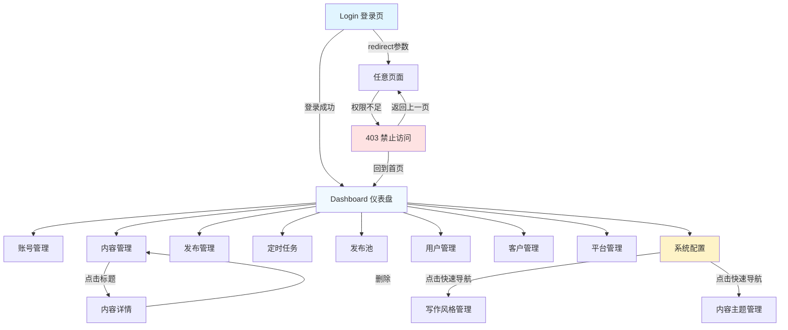

# ContentHub 前端页面交互逻辑分析报告

## 📊 报告概览

**分析时间**: 2026-01-29
**项目名称**: ContentHub 内容运营管理系统
**分析范围**: 所有前端页面组件、路由配置、交互逻辑
**页面总数**: 15 个页面
**技术栈**: Vue 3 + Vite + Element Plus + Pinia + Vue Router

---

## 📁 目录

1. [路由架构分析](#路由架构分析)
2. [页面分类与功能](#页面分类与功能)
3. [页面详细分析](#页面详细分析)
4. [页面跳转关系](#页面跳转关系)
5. [主要交互模式](#主要交互模式)
6. [API 调用映射](#api-调用映射)
7. [状态管理使用](#状态管理使用)
8. [表单验证规则](#表单验证规则)
9. [测试顺序建议](#测试顺序建议)

---

## 🛣️ 路由架构分析

### 路由配置结构

```javascript
/src/frontend/src/router/index.js
```

### 路由层次

```
├── /login (Login.vue) - 登录页（无需认证）
├── /403 (403.vue) - 权限拒绝页（无需认证）
└── / (MainLayout.vue) - 主布局（需要认证）
    ├── / - Dashboard 仪表盘
    ├── /accounts - 账号管理
    ├── /content - 内容管理
    ├── /content/:id - 内容详情
    ├── /publisher - 发布管理
    ├── /scheduler - 定时任务
    ├── /publish-pool - 发布池
    ├── /users - 用户管理（管理员）
    ├── /customers - 客户管理（管理员）
    ├── /platforms - 平台管理（管理员）
    ├── /config - 系统配置（管理员）
    ├── /writing-styles - 写作风格管理（管理员）
    └── /content-themes - 内容主题管理（管理员）
```

### 路由守卫机制

**认证检查**:
- 所有主布局下的页面需要登录
- 未登录用户会被重定向到登录页，并携带 `redirect` 参数

**权限检查**:
- `meta.permissions` 数组定义所需权限
- 使用 `userStore.hasAnyPermission()` 检查
- 权限不足时跳转 403 页面

**角色检查**:
- `meta.role` 定义所需角色
- 管理员专属页面：users, customers, platforms, config, writing-styles, content-themes

---

## 📄 页面分类与功能

### 1. 公共页面（2个）

| 页面 | 路由 | 功能 |
|------|------|------|
| Login | `/login` | 用户登录认证 |
| 403 Forbidden | `/403` | 权限拒绝提示 |

### 2. 核心业务页面（6个）

| 页面 | 路由 | 权限要求 | 功能 |
|------|------|----------|------|
| Dashboard | `/` | 登录 | 数据统计、活动记录 |
| AccountManage | `/accounts` | account:read | 账号 CRUD、状态同步 |
| ContentManage | `/content` | content:read | 内容 CRUD、AI生成、预览 |
| ContentDetail | `/content/:id` | content:read | 内容详情查看、编辑 |
| PublishManage | `/publisher` | publisher:read | 发布记录查看、重试、取消 |
| SchedulerManage | `/scheduler` | scheduler:read | 定时任务 CRUD、启停控制 |
| PublishPool | `/publish-pool` | publish-pool:read | 发布池管理、批量发布 |

### 3. 管理员页面（5个）

| 页面 | 路由 | 角色 | 功能 |
|------|------|------|------|
| UserManage | `/users` | admin | 用户 CRUD、密码重置 |
| CustomerManage | `/customers` | admin | 客户 CRUD、批量删除 |
| PlatformManage | `/platforms` | admin | 平台 CRUD |
| SystemConfig | `/config` | admin | 系统配置管理 |
| WritingStyleManage | `/writing-styles` | admin | 写作风格 CRUD |
| ContentThemeManage | `/content-themes` | admin | 内容主题 CRUD |

---

## 📝 页面详细分析

### 1. Login.vue - 登录页

**路径**: `/Users/Oychao/Documents/Projects/content-hub/src/frontend/src/pages/Login.vue`

**表单元素**:
- `username` (输入框) - 用户名，必填，3-20字符
- `password` (密码框) - 密码，必填，6-20字符，可显示/隐藏
- `remember` (复选框) - 记住登录状态

**交互逻辑**:
- 表单验证失败时阻止提交
- 点击"登录"或按回车键触发 `handleLogin()`
- 调用 `userStore.login()` 进行认证
- 登录成功后跳转到 `redirect` 参数指定页面或首页
- 显示默认账号提示：admin / 123456

**API 调用**:
- `userStore.login({ username, password })` → POST `/api/v1/auth/login`

**页面跳转**:
- 成功: `router.push(redirect || '/')`
- 失败: 保持在当前页，显示错误消息

**Stores 使用**:
- `useUserStore()` - 用户认证状态管理

---

### 2. Dashboard.vue - 仪表盘

**路径**: `/Users/Oychao/Documents/Projects/content-hub/src/frontend/src/pages/Dashboard.vue`

**展示内容**:
- 4 个统计卡片：总账号数、内容总数、发布总数、定时任务
- 2 个图表区域：内容趋势、发布统计（占位符）
- 活动时间线：最近 5 条活动记录

**交互元素**:
- "刷新"按钮：重新获取活动数据

**API 调用**:
- `dashboardApi.getDashboardStats()` → GET `/api/v1/dashboard/stats`
- `dashboardApi.getRecentActivities({ limit: 5 })` → GET `/api/v1/dashboard/activities`

**页面跳转**:
- 无直接跳转

**数据刷新**:
- 页面挂载时自动加载统计数据和活动记录
- 点击"刷新"按钮重新加载活动记录

---

### 3. AccountManage.vue - 账号管理

**路径**: `/Users/Oychao/Documents/Projects/content-hub/src/frontend/src/pages/AccountManage.vue`

**搜索表单**:
- `name` - 账号名称（模糊搜索）
- `platform_id` - 平台（下拉选择）
- `status` - 状态（启用/禁用）

**表格功能**:
- 多选：支持批量删除
- 列：账号名称、平台、账号ID、状态、创建时间、操作

**操作按钮**:
- 查看 - 所有角色可用
- 编辑 - admin 和 operator
- 同步 - admin 和 operator
- 删除 - 仅 admin

**表单对话框**:
- `name` - 账号名称，必填
- `platform_id` - 所属平台，必填
- `account_id` - 账号ID，必填
- `credentials` - 认证信息（JSON格式），必填
- `status` - 状态（启用/禁用）
- `remark` - 备注

**权限控制**:
- `v-permission="['account:create']"` - 新建按钮
- `v-permission="['account:update']"` - 编辑/同步按钮
- `v-role="'admin'"` - 删除按钮

**API 调用**:
- `accountsApi.getAccounts(params)` → GET `/api/v1/accounts`
- `platformsApi.getPlatforms({ page_size: 100 })` → GET `/api/v1/platforms`
- `accountsApi.createAccount(data)` → POST `/api/v1/accounts`
- `accountsApi.updateAccount(id, data)` → PUT `/api/v1/accounts/:id`
- `accountsApi.deleteAccount(id)` → DELETE `/api/v1/accounts/:id`
- `accountsApi.batchDeleteAccounts(ids)` → DELETE `/api/v1/accounts/batch`
- `accountsApi.syncAccount(id)` → POST `/api/v1/accounts/:id/sync`

**页面跳转**:
- 无

---

### 4. ContentManage.vue - 内容管理

**路径**: `/Users/Oychao/Documents/Projects/content-hub/src/frontend/src/pages/ContentManage.vue`

**搜索表单**:
- `title` - 标题
- `status` - 状态（草稿/待审核/已发布）
- `content_type` - 内容类型（文章/图文/视频）

**表格操作**:
- 查看、编辑、预览、生成、删除
- 批量删除、添加到发布池

**表单字段**:
- `title` - 标题，必填
- `content_type` - 内容类型，必填
- `content` - 内容，必填
- `summary` - 摘要
- `status` - 状态
- `tags` - 标签（逗号分隔）
- `cover_image` - 封面图URL

**AI 生成对话框**:
- `topic` - 主题，必填
- `keywords` - 关键词（逗号分隔）
- `content_type` - 内容类型，必填

**特殊组件**:
- `MarkdownPreview` - Markdown 内容预览
- `ImagePreview` - 图片预览

**API 调用**:
- `contentApi.getContentList(params)` → GET `/api/v1/content`
- `contentApi.createContent(data)` → POST `/api/v1/content`
- `contentApi.updateContent(id, data)` → PUT `/api/v1/content/:id`
- `contentApi.deleteContent(id)` → DELETE `/api/v1/content/:id`
- `contentApi.batchDeleteContent(ids)` → DELETE `/api/v1/content/batch`
- `contentApi.generateContent(data)` → POST `/api/v1/content/generate`

**页面跳转**:
- 无直接跳转，但有内容详情页链接支持

---

### 5. ContentDetail.vue - 内容详情

**路径**: `/Users/Oychao/Documents/Projects/content-hub/src/frontend/src/pages/ContentDetail.vue`

**页面布局**:
- 左侧：内容主体（封面图、内容、摘要、标签）
- 右侧：信息面板、操作按钮

**操作按钮**:
- 编辑内容 - 打开编辑对话框
- 预览内容 - 打开预览对话框
- 添加到发布池 - 功能开发中
- 删除内容 - 删除后跳转到内容列表

**API 调用**:
- `contentApi.getContent(id)` → GET `/api/v1/content/:id`
- `contentApi.updateContent(id, data)` → PUT `/api/v1/content/:id`
- `contentApi.deleteContent(id)` → DELETE `/api/v1/content/:id`

**页面跳转**:
- 删除成功: `router.push('/content')`

**特殊组件**:
- `ContentEditor` - 内容编辑器（支持 Markdown）
- `MarkdownPreview` - Markdown 预览
- `ImagePreview` - 图片预览

---

### 6. PublishManage.vue - 发布管理

**路径**: `/Users/Oychao/Documents/Projects/content-hub/src/frontend/src/pages/PublishManage.vue`

**搜索表单**:
- `title` - 内容标题
- `status` - 发布状态
- `platform_id` - 平台

**表格列**:
- 内容标题、平台、账号、状态、发布时间、操作

**操作按钮**（条件显示）:
- 查看 - 所有记录
- 重试 - 仅 failed 状态
- 取消 - 仅 pending 状态

**状态类型**:
- `pending` - 待发布
- `publishing` - 发布中
- `published` - 已发布
- `failed` - 发布失败

**API 调用**:
- `publisherApi.getPublishRecords(params)` → GET `/api/v1/publisher/records`
- `platformsApi.getPlatforms({ page_size: 100 })` → GET `/api/v1/platforms`
- `publisherApi.retryPublish(id)` → POST `/api/v1/publisher/records/:id/retry`
- `publisherApi.cancelPublish(id)` → POST `/api/v1/publisher/records/:id/cancel`

**查看详情**:
- 使用 `ElMessageBox.alert` 显示 HTML 格式详情

---

### 7. SchedulerManage.vue - 定时任务管理

**路径**: `/Users/Oychao/Documents/Projects/content-hub/src/frontend/src/pages/SchedulerManage.vue`

**搜索表单**:
- `name` - 任务名称
- `job_type` - 任务类型（内容生成/定时发布）
- `status` - 状态（运行中/暂停/已停止）

**表格操作**（条件显示）:
- 查看、编辑 - 所有状态
- 暂停 - 仅 running 状态
- 恢复 - 仅 paused 状态
- 停止 - 非 stopped 状态
- 立即执行 - 所有状态

**表单字段**:
- `name` - 任务名称，必填
- `job_type` - 任务类型，必填
- `cron_expression` - Cron表达式，必填（格式：分 时 日 月 周）
- `job_params` - 任务参数（JSON格式），必填
- `description` - 描述

**API 调用**:
- `schedulerApi.getSchedulerTasks(params)` → GET `/api/v1/scheduler/tasks`
- `schedulerApi.createSchedulerTask(data)` → POST `/api/v1/scheduler/tasks`
- `schedulerApi.updateSchedulerTask(id, data)` → PUT `/api/v1/scheduler/tasks/:id`
- `schedulerApi.pauseTask(id)` → POST `/api/v1/scheduler/tasks/:id/pause`
- `schedulerApi.resumeTask(id)` → POST `/api/v1/scheduler/tasks/:id/resume`
- `schedulerApi.stopTask(id)` → POST `/api/v1/scheduler/tasks/:id/stop`
- `schedulerApi.executeTask(id)` → POST `/api/v1/scheduler/tasks/:id/execute`

---

### 8. PublishPool.vue - 发布池

**路径**: `/Users/Oychao/Documents/Projects/content-hub/src/frontend/src/pages/PublishPool.vue`

**顶部操作**:
- 添加到发布池
- 批量发布（需要选中项）
- 清空已发布

**表单字段**:
- `content_id` - 内容，必填（下拉选择）
- `platform_id` - 平台，必填（下拉选择）
- `account_id` - 账号，必填（下拉选择）
- `publish_time` - 发布时间，必填（日期时间选择器）
- `priority` - 优先级（低/中/高）

**表格操作**:
- 查看、编辑、发布（仅 pending）、删除
- 批量发布（选中多个 pending 项）

**API 调用**:
- `publishPoolApi.getPublishPool(params)` → GET `/api/v1/publish-pool`
- `contentApi.getContentList({ page_size: 100 })` → GET `/api/v1/content`
- `platformsApi.getPlatforms({ page_size: 100 })` → GET `/api/v1/platforms`
- `accountsApi.getAccounts({ page_size: 100 })` → GET `/api/v1/accounts`
- `publishPoolApi.addToPublishPool(data)` → POST `/api/v1/publish-pool`
- `publishPoolApi.updatePublishPoolItem(id, data)` → PUT `/api/v1/publish-pool/:id`
- `publishPoolApi.batchPublish({ ids })` → POST `/api/v1/publish-pool/batch-publish`
- `publishPoolApi.clearPublished()` → DELETE `/api/v1/publish-pool/clear`
- `publishPoolApi.deletePublishPoolItem(id)` → DELETE `/api/v1/publish-pool/:id`

**特殊逻辑**:
- 页面加载时并发获取内容、平台、账号列表作为下拉选项
- 使用 `Promise.all` 并发请求优化性能

---

### 9. UserManage.vue - 用户管理

**路径**: `/Users/Oychao/Documents/Projects/content-hub/src/frontend/src/pages/UserManage.vue`

**搜索表单**:
- `username` - 用户名
- `role` - 角色（管理员/运营）
- `status` - 状态（启用/禁用）

**表格操作**:
- 查看、编辑、重置密码、删除

**表单字段**:
- `username` - 用户名，必填（仅创建时可编辑）
- `email` - 邮箱，必填
- `password` - 密码，必填（仅创建时显示）
- `role` - 角色，必填
- `status` - 状态（启用/禁用）

**重置密码**:
- 使用 `ElMessageBox.prompt` 弹出输入框
- 验证规则：6-20字符

**API 调用**:
- `usersApi.getUsers(params)` → GET `/api/v1/users`
- `usersApi.createUser(data)` → POST `/api/v1/users`
- `usersApi.updateUser(id, data)` → PUT `/api/v1/users/:id`
- `usersApi.deleteUser(id)` → DELETE `/api/v1/users/:id`
- `usersApi.resetUserPassword(id, { password })` → POST `/api/v1/users/:id/reset-password`

**权限要求**: admin

---

### 10. CustomerManage.vue - 客户管理

**路径**: `/Users/Oychao/Documents/Projects/content-hub/src/frontend/src/pages/CustomerManage.vue`

**搜索表单**:
- `name` - 客户名称
- `contact` - 联系人
- `status` - 状态（启用/禁用）

**表格功能**:
- 多选：支持批量删除
- 操作：查看、编辑、删除

**表单字段**:
- `name` - 客户名称，必填
- `contact` - 联系人，必填
- `email` - 邮箱
- `phone` - 电话
- `address` - 地址
- `status` - 状态（启用/禁用）
- `remark` - 备注

**API 调用**:
- `customersApi.getCustomers(params)` → GET `/api/v1/customers`
- `customersApi.createCustomer(data)` → POST `/api/v1/customers`
- `customersApi.updateCustomer(id, data)` → PUT `/api/v1/customers/:id`
- `customersApi.deleteCustomer(id)` → DELETE `/api/v1/customers/:id`
- `customersApi.batchDeleteCustomers(ids)` → DELETE `/api/v1/customers/batch`

**权限要求**: admin

---

### 11. PlatformManage.vue - 平台管理

**路径**: `/Users/Oychao/Documents/Projects/content-hub/src/frontend/src/pages/PlatformManage.vue`

**搜索表单**:
- `name` - 平台名称
- `platform_type` - 平台类型（微信公众号/微博/抖音）
- `status` - 状态（启用/禁用）

**表格操作**:
- 查看、编辑、删除

**表单字段**:
- `name` - 平台名称，必填
- `platform_type` - 平台类型，必填
- `app_id` - App ID，必填
- `app_secret` - App Secret，必填（密码框）
- `callback_url` - 回调地址
- `status` - 状态（启用/禁用）
- `config` - 其他配置（JSON格式）
- `remark` - 备注

**平台类型映射**:
- `wechat_mp` → 微信公众号
- `weibo` → 微博
- `douyin` → 抖音

**API 调用**:
- `platformsApi.getPlatforms(params)` → GET `/api/v1/platforms`
- `platformsApi.createPlatform(data)` → POST `/api/v1/platforms`
- `platformsApi.updatePlatform(id, data)` → PUT `/api/v1/platforms/:id`
- `platformsApi.deletePlatform(id)` → DELETE `/api/v1/platforms/:id`

**权限要求**: admin

---

### 12. SystemConfig.vue - 系统配置

**路径**: `/Users/Oychao/Documents/Projects/content-hub/src/frontend/src/pages/SystemConfig.vue`

**快速导航**:
- 写作风格管理 → `router.push('/writing-styles')`
- 内容主题管理 → `router.push('/content-themes')`

**配置分类**（Tab 页）:
1. **基本配置**
   - 系统名称、系统描述、管理员邮箱
   - 默认语言、时区

2. **内容生成配置**
   - 默认文章长度、生成超时时间
   - 自动保存开关、保存间隔

3. **发布配置**
   - 默认发布策略（立即/定时/手动）
   - 发布重试次数、重试间隔
   - 发布审核开关

4. **定时任务配置**
   - 最大并发任务数、任务超时时间
   - 任务日志开关、日志保留天数

5. **API 配置**
   - API 速率限制、Token 过期时间
   - CORS 开关、允许的来源

**存储方式**:
- 临时方案：localStorage（键名：`system_config`）
- TODO: 应调用后端 API 保存配置

**API 调用**: 无（当前使用 localStorage）

**权限要求**: admin

---

### 13. WritingStyleManage.vue - 写作风格管理

**路径**: `/Users/Oychao/Documents/Projects/content-hub/src/frontend/src/pages/WritingStyleManage.vue`

**搜索表单**:
- `name` - 风格名称
- `code` - 风格代码
- `is_system` - 类型（系统级/自定义）

**表格操作**:
- 查看、编辑、删除（系统级风格不可删除）

**表单字段**:
- `name` - 风格名称，必填
- `code` - 风格代码，必填（编辑时禁用）
- `description` - 描述
- `tone` - 语气（专业/轻松/幽默/正式/亲切）
- `emoji_usage` - 表情使用（不使用/适度/频繁）
- `persona` - 人设
- `min_words` - 最小字数（100-10000）
- `max_words` - 最大字数（100-10000）
- `forbidden_words` - 禁用词（多选）
- `is_system` - 系统级风格开关

**详情展示**:
- 使用 `el-descriptions` 显示完整风格信息

**API 调用**:
- `config.getWritingStyles(params)` → GET `/api/v1/config/writing-styles`
- `config.getWritingStyle(id)` → GET `/api/v1/config/writing-styles/:id`
- `config.createWritingStyle(data)` → POST `/api/v1/config/writing-styles`
- `config.updateWritingStyle(id, data)` → PUT `/api/v1/config/writing-styles/:id`
- `config.deleteWritingStyle(id)` → DELETE `/api/v1/config/writing-styles/:id`

**权限要求**: admin

---

### 14. ContentThemeManage.vue - 内容主题管理

**路径**: `/Users/Oychao/Documents/Projects/content-hub/src/frontend/src/pages/ContentThemeManage.vue`

**搜索表单**:
- `name` - 主题名称
- `code` - 主题代码
- `type` - 主题类型（技术/生活/教育/娱乐/商业）
- `is_system` - 系统级（系统级/自定义）

**表格操作**:
- 查看、编辑、删除（系统级主题不可删除）

**表单字段**:
- `name` - 主题名称，必填
- `code` - 主题代码，必填（编辑时禁用）
- `type` - 主题类型
- `description` - 描述
- `is_system` - 系统级主题开关

**详情展示**:
- 使用 `el-descriptions` 显示完整主题信息

**API 调用**:
- `config.getContentThemes(params)` → GET `/api/v1/config/content-themes`
- `config.getContentTheme(id)` → GET `/api/v1/config/content-themes/:id`
- `config.createContentTheme(data)` → POST `/api/v1/config/content-themes`
- `config.updateContentTheme(id, data)` → PUT `/api/v1/config/content-themes/:id`
- `config.deleteContentTheme(id)` → DELETE `/api/v1/config/content-themes/:id`

**权限要求**: admin

---

### 15. 403.vue - 权限拒绝页

**路径**: `/Users/Oychao/Documents/Projects/content-hub/src/frontend/src/pages/403.vue`

**页面元素**:
- 错误代码：403
- 错误标题：访问被拒绝
- 错误描述：权限说明文字

**操作按钮**:
- 返回上一页：`router.back()`
- 回到首页：`router.push({ name: 'Dashboard' })`

**触发场景**:
- 路由守卫检测到权限不足
- 路由守卫检测到角色不匹配

---

## 🔗 页面跳转关系

### 跳转关系图（Mermaid）



### 跳转类型统计

| 跳转类型 | 数量 | 说明 |
|----------|------|------|
| router.push() | 5 | 编程式导航 |
| router.back() | 1 | 返回上一页 |
| 自动跳转 | 3 | 登录后、权限检查、删除后 |

### 主要跳转场景

1. **登录流程**:
   - 登录页 → 首页（或重定向页面）

2. **权限拦截**:
   - 任意页 → 403 页

3. **内容管理流程**:
   - 内容列表 → 内容详情
   - 内容详情 → 内容列表（删除后）

4. **配置管理流程**:
   - 系统配置 → 写作风格管理
   - 系统配置 → 内容主题管理

---

## 🎮 主要交互模式

### 1. CRUD 模式

**适用页面**: 账号管理、内容管理、用户管理、客户管理、平台管理等

**标准流程**:
1. **列表展示**: 分页表格展示数据
2. **搜索过滤**: 顶部搜索表单
3. **新建**: 点击"新建"按钮 → 填写表单 → 提交
4. **查看**: 点击"查看"按钮 → 对话框显示详情（只读）
5. **编辑**: 点击"编辑"按钮 → 填写表单（预填充）→ 提交
6. **删除**: 点击"删除"按钮 → 确认对话框 → 删除

**表单验证**:
- 使用 `el-form` 的 `rules` 属性
- 调用 `commonRules` 从 `useFormValidation` 获取验证规则
- 提交前调用 `formRef.value.validate()`

**对话框状态**:
- `dialogMode`: 'create' | 'edit' | 'view'
- `dialogTitle`: 根据模式动态设置
- `isEdit`: 布尔值（部分页面使用）

### 2. 搜索和分页模式

**搜索表单**:
- 使用 `SearchForm` 组件
- `v-model` 绑定搜索条件
- 触发 `@search` 和 `@reset` 事件

**分页组件**:
- 使用 `DataTable` 组件（封装了 `el-table` 和分页）
- 触发 `@page-change` 和 `@size-change` 事件

**数据加载流程**:
```javascript
1. 用户输入搜索条件
2. 点击"搜索"按钮
3. 重置页码为 1
4. 调用 fetchTableData()
5. 更新 tableData 和 total
```

### 3. 批量操作模式

**适用页面**: 账号管理、内容管理、客户管理、发布池

**实现方式**:
- 表格开启 `selectable` 属性
- 监听 `@selection-change` 事件
- 选中项存储在 `selectedRows` 数组
- 底部固定操作栏（条件显示）

**批量操作类型**:
- 批量删除
- 批量发布（发布池）

### 4. 状态管理模式

**定时任务管理**:
- 状态：running, paused, stopped
- 操作按钮根据状态条件显示
- 操作：暂停、恢复、停止、立即执行

**发布管理**:
- 状态：pending, publishing, published, failed
- 操作：重试（failed）、取消（pending）

### 5. 对话框模式

**表单对话框**:
- CRUD 操作的表单输入
- 支持查看模式（只读）
- 关闭时重置表单

**详情对话框**:
- 使用 `el-descriptions` 展示
- 仅查看，无编辑功能

**确认对话框**:
- 删除操作：`ElMessageBox.confirm`
- 重置密码：`ElMessageBox.prompt`

**预览对话框**:
- Markdown 内容预览
- 图片预览

### 6. 权限控制模式

**指令控制**:
- `v-permission="['permission:code']"` - 按钮级权限
- `v-role="'admin'"` - 角色级权限

**路由守卫**:
- `meta.permissions` - 页面级权限
- `meta.role` - 角色要求

### 7. 加载状态管理

**加载状态**:
- `loading` - 表格数据加载
- `submitLoading` - 表单提交
- `generateLoading` - AI 生成

**用户反馈**:
- `ElMessage.success()` - 成功提示
- `ElMessage.error()` - 错误提示
- `ElMessage.info()` - 信息提示

---

## 📡 API 调用映射

### API 模块结构

```
/src/frontend/src/api/
├── index.js                    # API 入口，导出所有模块
└── modules/
    ├── auth.js                 # 认证相关
    ├── accounts.js             # 账号管理
    ├── content.js              # 内容管理
    ├── publisher.js            # 发布管理
    ├── scheduler.js            # 定时任务
    ├── publishPool.js          # 发布池
    ├── users.js                # 用户管理
    ├── customers.js            # 客户管理
    ├── platforms.js            # 平台管理
    ├── config.js               # 配置管理（写作风格/主题）
    ├── dashboard.js            # 仪表盘
    └── cache.js                # 缓存管理
```

### 主要 API 调用汇总

| API 模块 | 方法 | 端点 | 使用页面 |
|----------|------|------|----------|
| **auth** | login | POST /api/v1/auth/login | Login |
| **accounts** | getAccounts | GET /api/v1/accounts | AccountManage |
| | createAccount | POST /api/v1/accounts | AccountManage |
| | updateAccount | PUT /api/v1/accounts/:id | AccountManage |
| | deleteAccount | DELETE /api/v1/accounts/:id | AccountManage |
| | batchDeleteAccounts | DELETE /api/v1/accounts/batch | AccountManage |
| | syncAccount | POST /api/v1/accounts/:id/sync | AccountManage |
| **content** | getContentList | GET /api/v1/content | ContentManage |
| | getContent | GET /api/v1/content/:id | ContentDetail |
| | createContent | POST /api/v1/content | ContentManage |
| | updateContent | PUT /api/v1/content/:id | ContentManage, ContentDetail |
| | deleteContent | DELETE /api/v1/content/:id | ContentManage, ContentDetail |
| | batchDeleteContent | DELETE /api/v1/content/batch | ContentManage |
| | generateContent | POST /api/v1/content/generate | ContentManage |
| **publisher** | getPublishRecords | GET /api/v1/publisher/records | PublishManage |
| | retryPublish | POST /api/v1/publisher/records/:id/retry | PublishManage |
| | cancelPublish | POST /api/v1/publisher/records/:id/cancel | PublishManage |
| **scheduler** | getSchedulerTasks | GET /api/v1/scheduler/tasks | SchedulerManage |
| | createSchedulerTask | POST /api/v1/scheduler/tasks | SchedulerManage |
| | updateSchedulerTask | PUT /api/v1/scheduler/tasks/:id | SchedulerManage |
| | pauseTask | POST /api/v1/scheduler/tasks/:id/pause | SchedulerManage |
| | resumeTask | POST /api/v1/scheduler/tasks/:id/resume | SchedulerManage |
| | stopTask | POST /api/v1/scheduler/tasks/:id/stop | SchedulerManage |
| | executeTask | POST /api/v1/scheduler/tasks/:id/execute | SchedulerManage |
| **publishPool** | getPublishPool | GET /api/v1/publish-pool | PublishPool |
| | addToPublishPool | POST /api/v1/publish-pool | PublishPool |
| | updatePublishPoolItem | PUT /api/v1/publish-pool/:id | PublishPool |
| | batchPublish | POST /api/v1/publish-pool/batch-publish | PublishPool |
| | clearPublished | DELETE /api/v1/publish-pool/clear | PublishPool |
| | deletePublishPoolItem | DELETE /api/v1/publish-pool/:id | PublishPool |
| **users** | getUsers | GET /api/v1/users | UserManage |
| | createUser | POST /api/v1/users | UserManage |
| | updateUser | PUT /api/v1/users/:id | UserManage |
| | deleteUser | DELETE /api/v1/users/:id | UserManage |
| | resetUserPassword | POST /api/v1/users/:id/reset-password | UserManage |
| **customers** | getCustomers | GET /api/v1/customers | CustomerManage |
| | createCustomer | POST /api/v1/customers | CustomerManage |
| | updateCustomer | PUT /api/v1/customers/:id | CustomerManage |
| | deleteCustomer | DELETE /api/v1/customers/:id | CustomerManage |
| | batchDeleteCustomers | DELETE /api/v1/customers/batch | CustomerManage |
| **platforms** | getPlatforms | GET /api/v1/platforms | 多个页面 |
| | createPlatform | POST /api/v1/platforms | PlatformManage |
| | updatePlatform | PUT /api/v1/platforms/:id | PlatformManage |
| | deletePlatform | DELETE /api/v1/platforms/:id | PlatformManage |
| **config** | getWritingStyles | GET /api/v1/config/writing-styles | WritingStyleManage |
| | getWritingStyle | GET /api/v1/config/writing-styles/:id | WritingStyleManage |
| | createWritingStyle | POST /api/v1/config/writing-styles | WritingStyleManage |
| | updateWritingStyle | PUT /api/v1/config/writing-styles/:id | WritingStyleManage |
| | deleteWritingStyle | DELETE /api/v1/config/writing-styles/:id | WritingStyleManage |
| | getContentThemes | GET /api/v1/config/content-themes | ContentThemeManage |
| | getContentTheme | GET /api/v1/config/content-themes/:id | ContentThemeManage |
| | createContentTheme | POST /api/v1/config/content-themes | ContentThemeManage |
| | updateContentTheme | PUT /api/v1/config/content-themes/:id | ContentThemeManage |
| | deleteContentTheme | DELETE /api/v1/config/content-themes/:id | ContentThemeManage |
| **dashboard** | getDashboardStats | GET /api/v1/dashboard/stats | Dashboard |
| | getRecentActivities | GET /api/v1/dashboard/activities | Dashboard |

---

## 🗄️ 状态管理使用

### Pinia Stores 结构

```
/src/frontend/src/stores/
├── index.js                     # Store 入口
└── modules/
    ├── user.js                  # 用户状态
    ├── app.js                   # 应用状态
    ├── cache.js                 # 缓存状态
    ├── account.js               # 账号状态
    ├── content.js               # 内容状态
    └── scheduler.js             # 定时任务状态
```

### 主要 Store 使用

#### 1. user.js - 用户状态管理

**使用页面**: Login.vue, router/index.js

**核心属性**:
- `user` - 当前用户信息
- `token` - 认证令牌
- `isAuthenticated` - 登录状态

**核心方法**:
- `login({ username, password })` - 登录
- `logout()` - 登出
- `hasAnyPermission(permissions)` - 权限检查
- `fetchUser()` - 获取用户信息

**使用示例**:
```javascript
import { useUserStore } from '../stores/modules/user'

const userStore = useUserStore()
await userStore.login({ username, password })
```

#### 2. 其他 Store

- **app.js**: 应用级状态（侧边栏折叠、主题等）
- **cache.js**: 数据缓存管理
- **account.js**: 账号相关状态
- **content.js**: 内容相关状态
- **scheduler.js**: 定时任务相关状态

**使用模式**:
- 大部分页面直接调用 API，不使用 Store
- Store 主要用于全局状态（用户、应用配置）

---

## ✅ 表单验证规则

### 验证规则来源

**文件**: `/src/frontend/src/composables/useFormValidation.js`

**导出对象**: `commonRules`

### 主要验证规则

#### 1. 账号管理 (AccountManage)

| 字段 | 规则函数 | 验证内容 |
|------|----------|----------|
| name | `accountName()` | 必填，2-50字符 |
| platform_id | `accountPlatformId()` | 必填 |
| account_id | 内联规则 | 必填，最小长度1 |
| credentials | 内联规则 | 必填 |

#### 2. 内容管理 (ContentManage)

| 字段 | 规则 | 验证内容 |
|------|------|----------|
| title | 内联规则 | 必填 |
| content_type | 内联规则 | 必选 |
| content | 内联规则 | 必填 |

#### 3. 用户管理 (UserManage)

| 字段 | 规则函数 | 验证内容 |
|------|----------|----------|
| username | `username()` | 必填，3-20字符，字母数字下划线 |
| email | `userEmail()` | 必填，邮箱格式 |
| password | `userPassword()` | 必填，6-20字符 |

#### 4. 客户管理 (CustomerManage)

| 字段 | 规则函数 | 验证内容 |
|------|----------|----------|
| name | `customerName()` | 必填，2-100字符 |
| contact | 内联规则 | 必填 |
| email | `customerEmail()` | 必填，邮箱格式 |
| phone | `customerPhone()` | 必填，手机号格式 |

#### 5. 平台管理 (PlatformManage)

| 字段 | 规则函数 | 验证内容 |
|------|----------|----------|
| name | `platformName()` | 必填，2-50字符 |
| platform_type | 内联规则 | 必选 |
| app_id | 内联规则 | 必填 |
| app_secret | 内联规则 | 必填 |
| callback_url | `platformApiUrl()` | 必填，URL格式 |

#### 6. 写作风格管理 (WritingStyleManage)

| 字段 | 规则函数 | 验证内容 |
|------|----------|----------|
| name | `writingStyleName()` | 必填，2-50字符 |
| code | `writingStyleCode()` | 必填，2-20字符，英文小写 |
| tone | `writingStyleTone()` | 必填 |
| min_words | `writingStyleWordRange().min_words` | 必填，100-10000 |
| max_words | `writingStyleWordRange().max_words` | 必填，100-10000 |

#### 7. 内容主题管理 (ContentThemeManage)

| 字段 | 规则函数 | 验证内容 |
|------|----------|----------|
| name | `contentThemeName()` | 必填，2-50字符 |
| code | `contentThemeCode()` | 必填，2-20字符，英文小写 |
| type | `contentThemeType()` | 必填 |

#### 8. 定时任务管理 (SchedulerManage)

| 字段 | 规则 | 验证内容 |
|------|------|----------|
| name | 内联规则 | 必填 |
| job_type | 内联规则 | 必选 |
| cron_expression | 内联规则 | 必填 |
| job_params | 内联规则 | 必填 |

#### 9. 发布池 (PublishPool)

| 字段 | 规则 | 验证内容 |
|------|------|----------|
| content_id | 内联规则 | 必选 |
| platform_id | 内联规则 | 必选 |
| account_id | 内联规则 | 必选 |
| publish_time | 内联规则 | 必选 |

### 验证触发时机

- `blur`: 失去焦点时验证
- `change`: 值改变时验证（下拉框、单选框等）

---

## 🧪 测试顺序建议

### 测试优先级分级

#### 优先级 1: 基础功能（必须首先测试）

**原因**: 这些是其他功能的前置条件

1. **Login.vue**
   - 测试正常登录
   - 测试错误凭证
   - 测试表单验证
   - 测试"记住我"功能
   - 测试登录后跳转

2. **Dashboard.vue**
   - 测试统计数据加载
   - 测试活动记录显示
   - 测试刷新功能

3. **403.vue**
   - 测试权限拒绝场景
   - 测试"返回上一页"按钮
   - 测试"回到首页"按钮

**预期时间**: 30-45 分钟

---

#### 优先级 2: 核心业务功能

**原因**: 主要业务流程

4. **AccountManage.vue**
   - 测试账号列表加载
   - 测试搜索和过滤
   - 测试新建账号
   - 测试编辑账号
   - 测试查看账号
   - 测试同步功能
   - 测试删除账号
   - 测试批量删除
   - 测试权限控制（不同角色）

5. **PlatformManage.vue**
   - 测试平台列表
   - 测试新建平台
   - 测试编辑平台
   - 测试删除平台
   - 测试平台类型映射

6. **ContentManage.vue**
   - 测试内容列表
   - 测试搜索和过滤
   - 测试新建内容
   - 测试编辑内容
   - 测试预览功能
   - 测试 AI 生成功能
   - 测试删除内容
   - 测试批量删除

7. **ContentDetail.vue**
   - 测试内容详情显示
   - 测试编辑功能
   - 测试预览功能
   - 测试图片点击
   - 测试删除后跳转

**预期时间**: 2-3 小时

---

#### 优先级 3: 发布和任务功能

**原因**: 依赖前面的数据

8. **PublishPool.vue**
   - 测试发布池列表
   - 测试添加到发布池
   - 测试编辑发布项
   - 测试单个发布
   - 测试批量发布
   - 测试清空已发布
   - 测试删除项
   - 测试下拉选项加载

9. **PublishManage.vue**
   - 测试发布记录列表
   - 测试搜索和过滤
   - 测试查看详情
   - 测试重试功能（failed 状态）
   - 测试取消功能（pending 状态）
   - 测试状态显示

10. **SchedulerManage.vue**
    - 测试定时任务列表
    - 测试新建任务
    - 测试编辑任务
    - 测试查看任务
    - 测试暂停功能
    - 测试恢复功能
    - 测试停止功能
    - 测试立即执行
    - 测试 Cron 表达式提示

**预期时间**: 2 小时

---

#### 优先级 4: 管理员功能

**原因**: 需要 admin 角色

11. **UserManage.vue**
    - 测试用户列表
    - 测试搜索和过滤
    - 测试新建用户
    - 测试编辑用户
    - 测试查看用户
    - 测试重置密码
    - 测试删除用户
    - 测试角色显示

12. **CustomerManage.vue**
    - 测试客户列表
    - 测试搜索和过滤
    - 测试新建客户
    - 测试编辑客户
    - 测试查看客户
    - 测试删除客户
    - 测试批量删除

13. **SystemConfig.vue**
    - 测试配置分类标签切换
    - 测试基本配置保存
    - 测试内容生成配置保存
    - 测试发布配置保存
    - 测试定时任务配置保存
    - 测试 API 配置保存
    - 测试快速导航跳转

14. **WritingStyleManage.vue**
    - 测试写作风格列表
    - 测试搜索和过滤
    - 测试新建风格
    - 测试编辑风格
    - 测试查看详情
    - 测试删除风格（系统级不可删）
    - 测试禁用词输入

15. **ContentThemeManage.vue**
    - 测试内容主题列表
    - 测试搜索和过滤
    - 测试新建主题
    - 测试编辑主题
    - 测试查看详情
    - 测试删除主题（系统级不可删）

**预期时间**: 2.5-3 小时

---

### 测试顺序总览

```
阶段 1: 基础功能（45分钟）
├── 1. Login.vue
├── 2. Dashboard.vue
└── 3. 403.vue

阶段 2: 核心业务（3小时）
├── 4. PlatformManage.vue（先创建平台）
├── 5. AccountManage.vue（需要平台数据）
├── 6. ContentManage.vue
└── 7. ContentDetail.vue

阶段 3: 发布和任务（2小时）
├── 8. PublishPool.vue（需要内容和账号）
├── 9. PublishManage.vue
└── 10. SchedulerManage.vue

阶段 4: 管理员功能（3小时）
├── 11. UserManage.vue
├── 12. CustomerManage.vue
├── 13. SystemConfig.vue
├── 14. WritingStyleManage.vue
└── 15. ContentThemeManage.vue

总计: 约 8.5-9 小时
```

---

### 关键测试路径

#### 完整业务流程测试

1. **内容生成到发布流程**:
   ```
   Login → PlatformManage（创建平台）→ AccountManage（创建账号）
   → ContentManage（AI生成内容）→ ContentDetail（查看详情）
   → PublishPool（添加到发布池）→ PublishManage（查看发布记录）
   ```

2. **定时任务流程**:
   ```
   SchedulerManage（创建定时任务）→ 查看任务列表
   → 暂停/恢复任务 → 立即执行 → 查看执行结果
   ```

3. **系统配置流程**:
   ```
   SystemConfig（配置系统）→ WritingStyleManage（创建写作风格）
   → ContentThemeManage（创建内容主题）→ ContentManage（使用配置）
   ```

---

## 📊 统计数据

### 页面统计

| 分类 | 数量 | 百分比 |
|------|------|--------|
| 公共页面 | 2 | 13.3% |
| 核心业务 | 7 | 46.7% |
| 管理员页面 | 6 | 40.0% |
| **总计** | **15** | **100%** |

### 表单统计

| 表单类型 | 数量 |
|----------|------|
| 登录表单 | 1 |
| CRUD 表单 | 10 |
| 搜索表单 | 11 |
| AI 生成表单 | 1 |
| 系统配置表单 | 5（分Tab） |
| **总计** | **28** |

### API 调用统计

| API 模块 | 方法数 |
|----------|--------|
| auth | 1 |
| accounts | 6 |
| content | 6 |
| publisher | 3 |
| scheduler | 6 |
| publishPool | 6 |
| users | 5 |
| customers | 5 |
| platforms | 4 |
| config (writing-styles) | 5 |
| config (content-themes) | 5 |
| dashboard | 2 |
| **总计** | **54** |

### 组件使用统计

| 组件类型 | 使用频率 |
|----------|----------|
| PageHeader | 14 |
| DataTable | 13 |
| SearchForm | 11 |
| el-dialog | 15+ |
| el-form | 15+ |
| el-table | 13 |
| el-button | 100+ |
| el-input | 50+ |
| el-select | 30+ |
| el-tag | 20+ |

---

## 🎯 完成标准检查

### ✅ 已完成项目

- [x] 读取所有 15 个页面组件
- [x] 分析路由配置
- [x] 提取表单输入元素
- [x] 提取按钮和操作元素
- [x] 映射 API 调用
- [x] 分析事件处理逻辑
- [x] 分析页面导航和跳转
- [x] 分析 Pinia stores 使用
- [x] 生成页面跳转关系图（Mermaid）
- [x] 提供测试顺序建议

### 📋 交付物

- [x] **FRONTEND-ANALYSIS.md** - 完整分析报告
  - 15 个页面的详细分析
  - 页面跳转关系图
  - 主要功能列表
  - API 调用映射表
  - 测试顺序建议

---

## 🔍 发现的主要交互模式

### 1. **统一的 CRUD 模式**
- 所有管理页面遵循相同的 CRUD 流程
- 表单验证规则统一从 `useFormValidation` 获取
- 对话框状态管理一致

### 2. **权限分层控制**
- 路由级权限（meta.permissions）
- 按钮级权限（v-permission 指令）
- 角色级权限（v-role 指令）

### 3. **状态驱动的操作**
- 定时任务：running → paused → stopped
- 发布记录：pending → publishing → published/failed
- 操作按钮根据状态条件显示

### 4. **批量操作模式**
- 表格多选
- 底部固定操作栏
- 批量删除、批量发布

### 5. **搜索和分页模式**
- 顶部搜索表单
- 底部分页组件
- 搜索时重置页码

### 6. **快速导航模式**
- 系统配置页面提供快速导航卡片
- 跳转到相关配置页面

---

## 💡 建议的测试重点

### 高优先级测试点

1. **权限控制测试**
   - 不同角色的按钮显示/隐藏
   - 路由权限拦截
   - 403 页面触发

2. **表单验证测试**
   - 所有必填字段验证
   - 格式验证（邮箱、手机号、URL等）
   - 长度验证

3. **API 调用测试**
   - CRUD 操作完整性
   - 错误处理
   - 加载状态显示

4. **页面跳转测试**
   - 登录后跳转
   - 删除后跳转
   - 权限不足跳转

5. **批量操作测试**
   - 多选功能
   - 批量删除
   - 批量发布

6. **状态流转测试**
   - 定时任务：运行 → 暂停 → 恢复 → 停止
   - 发布记录：待发布 → 发布中 → 已发布/失败

---

## 🚀 后续步骤建议

1. **基于此分析生成测试计划**
   - 每个页面的详细测试用例
   - 测试数据准备
   - 测试环境配置

2. **使用 Chrome DevTools 进行逐页测试**
   - 按照建议的测试顺序
   - 记录发现的问题
   - 验证所有交互功能

3. **性能测试**
   - 大数据量列表加载
   - 批量操作性能
   - API 响应时间

4. **兼容性测试**
   - 不同浏览器
   - 不同屏幕尺寸
   - 移动端适配

---

## 📝 总结

### 分析覆盖范围

- **页面数量**: 15 个
- **路由配置**: 1 个主文件
- **API 模块**: 12 个模块，54 个方法
- **交互模式**: 6 种主要模式
- **表单验证**: 9 个主要规则类别

### 关键发现

1. **架构清晰**: Vue 3 + Pinia + Vue Router 的标准架构
2. **权限完善**: 三层权限控制（路由、按钮、角色）
3. **交互一致**: 统一的 CRUD 模式和表单验证
4. **功能完整**: 涵盖内容运营的完整流程
5. **代码质量**: 使用组合式 API，组件复用性好

### 测试建议

- **总测试时间**: 约 8.5-9 小时
- **测试顺序**: 基础功能 → 核心业务 → 发布任务 → 管理员功能
- **测试重点**: 权限控制、表单验证、API 调用、页面跳转

---

**报告生成时间**: 2026-01-29
**分析工具**: Claude Code
**报告版本**: v1.0
